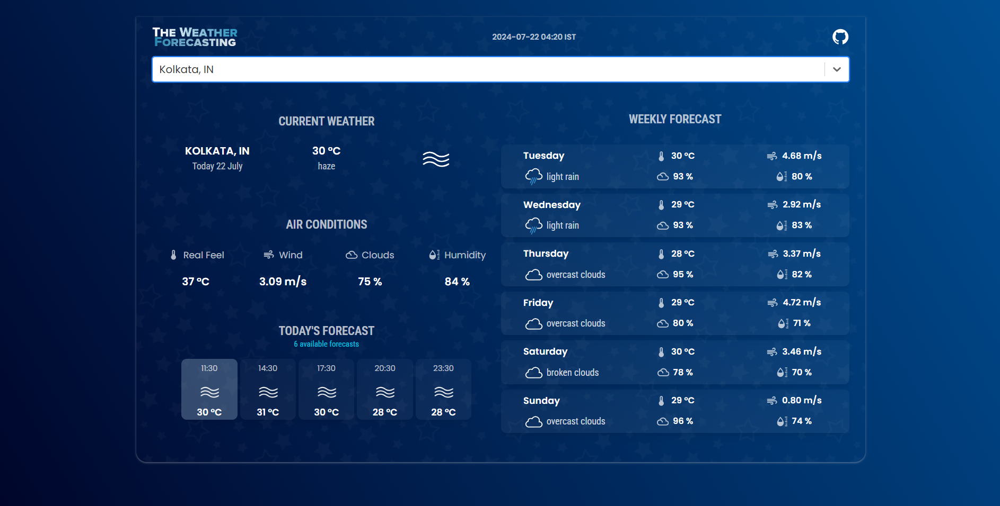

# The Weather Forecasting



[The Weather Forecasting](https://the-weather-forecasting-react.netlify.app/) is a sleek and modern React application built with Vite, TypeScript, and Material-UI. It provides detailed current weather and weekly forecasts using the OpenWeatherMap and GeoDB APIs.

Live Demo: [The Weather Forecasting](https://the-weather-forecasting-react.netlify.app/)

## Features

- **Current Weather**: View the current temperature, feels-like temperature, humidity, weather description, wind speed, and cloud coverage.
- **Today's Forecast**: Get detailed hourly forecasts for the current day.
- **Weekly Forecast**: Access a 7-day weather forecast with daily summaries.
- **City Search**: Search for cities worldwide using the GeoDB API.
- **Responsive Design**: Built with Material-UI for a responsive and modern user interface.

## Technologies Used

- **Vite**: Fast and lightweight build tool for modern web projects.
- **React**: A library for building user interfaces.
- **TypeScript**: A strongly typed programming language for enhanced development experience.
- **Material-UI**: A React component library for faster and easier web development.
- **OpenWeatherMap API**: Provides current weather data and a 5-day/3-hour forecast.
- **GeoDB API**: Allows searching for cities with various filters.

## Setup

1. **Clone the repository**:
   ```bash
   git clone https://github.com/satyamnoob/the-weather-forecasting.git
   cd the-weather-forecasting
   ```

2. **Install dependencies**
   ```bash
   npm install
   ```

3. **Create a .env file**:
Create a .env file in the root directory and add your API keys:
   ```bash
   VITE_GEO_DB_API_KEY="your_geodb_api_key"
   VITE_WEATHER_API_KEY="your_openweathermap_api_key"
   ```

4. **Start the application**:
   ```bash
   npm run dev
   ```